<div align="center">

# 🚀 Conet App

### 🌐 Connect • Match • Chat • Grow


---


</div>

---

## ✨ About the App

**Conet** is a modern social and collaboration platform built to connect people based on skills, interests, and meaningful conversations.

It combines:

* 💬 Real-time chat
* 🤝 Skill-based matching
* 🧠 Knowledge sharing
* 🎨 Beautiful UI with dark/light mode

Designed with **scalability and clean architecture in mind**.

---

## 📱 Features

### 🔐 Authentication

* Email login & signup
* Clean onboarding flow

### 💬 Real-Time Chat

* Smooth chat UI
* Message bubbles with modern design
* Dark & Light mode support

### 🤝 Match System

* Swipe-based matching (like Tinder)
* Like ❤️ / Reject ❌ / Star ⭐ actions
* Skill-based discovery

### 👥 Friends System

* Active users list
* Quick conversation access
* Online indicators

### 📝 Post Feed

* Create and view posts
* Like interactions
* Clean card-based UI

### 👤 Profile

* Avatar customization
* Bio & interests
* Editable user profile

### 🌙 Theme System

* Full dark/light mode
* Seamless UI adaptation

---

## 🎬 Screenshots

### 🏠 Home Feed

<p align="center">
  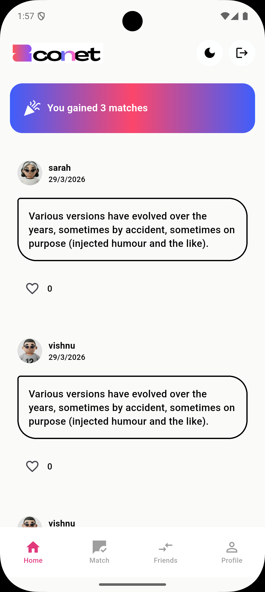
  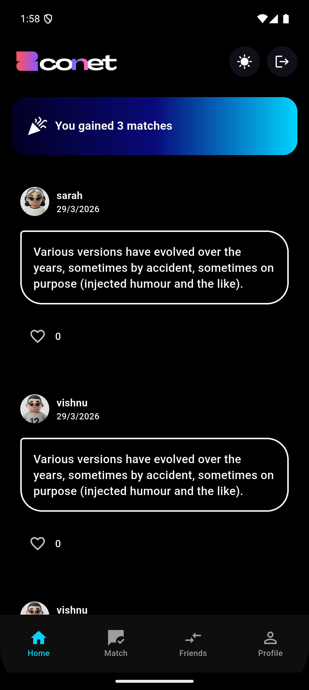
</p>

### 💬 Chat

<p align="center">
  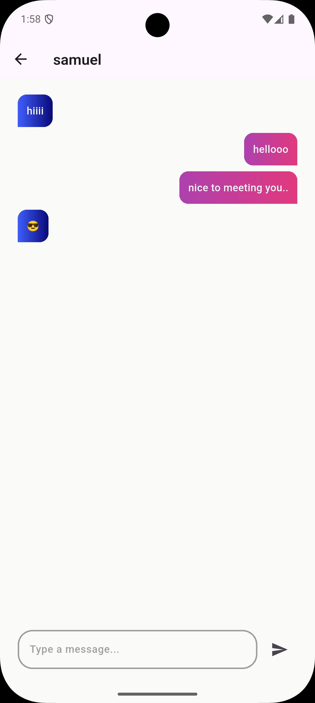
  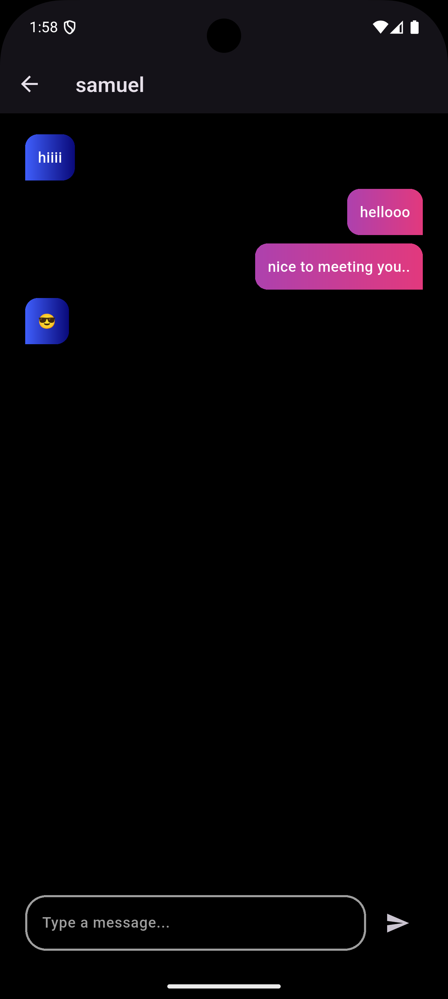
</p>

### 🤝 Match

<p align="center">
  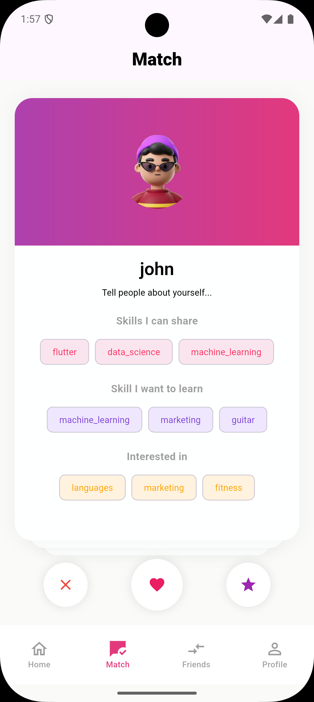
  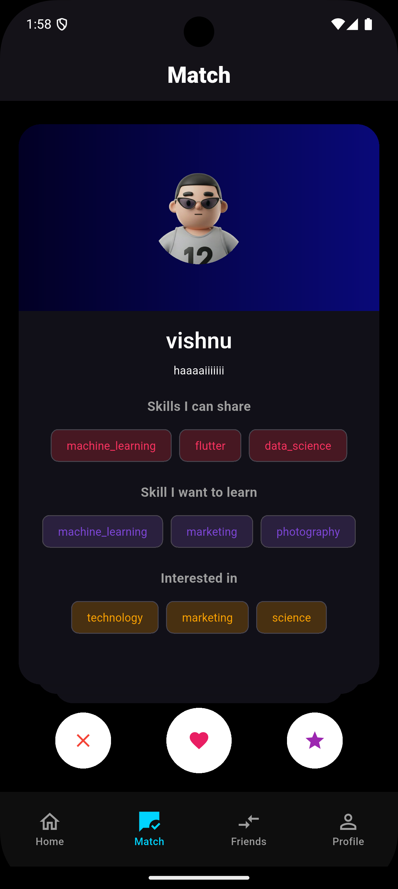
</p>

### 👥 Friends

<p align="center">
  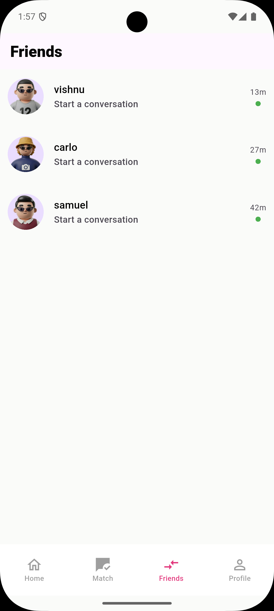
  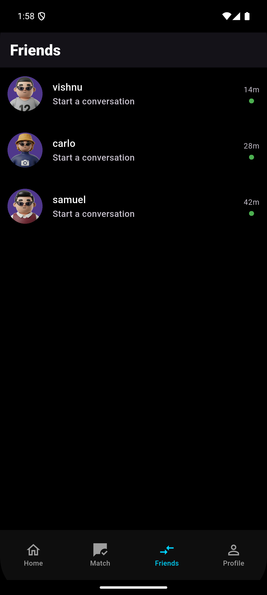
</p>

### 👤 Profile

<p align="center">
  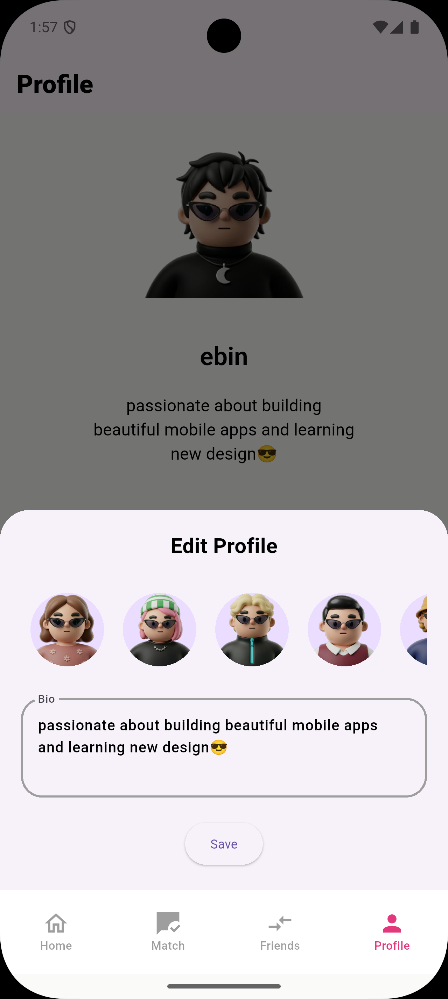
  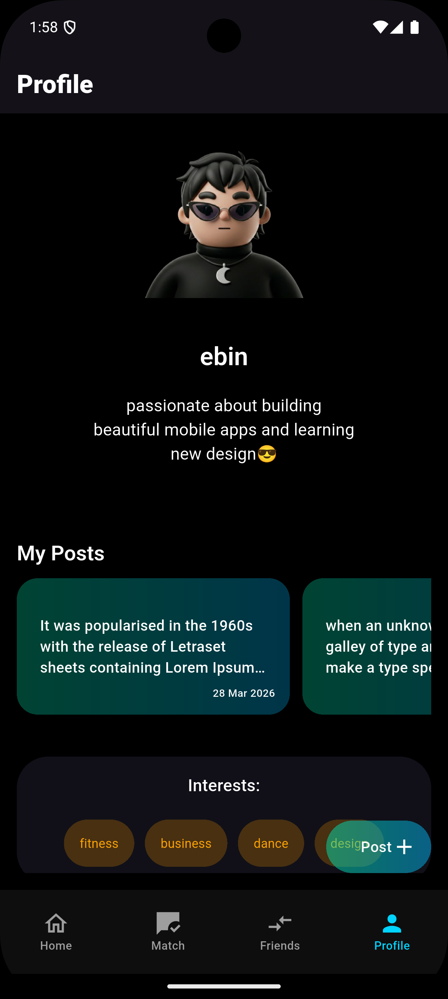
</p>

### 🔐 Authentication

<p align="center">
  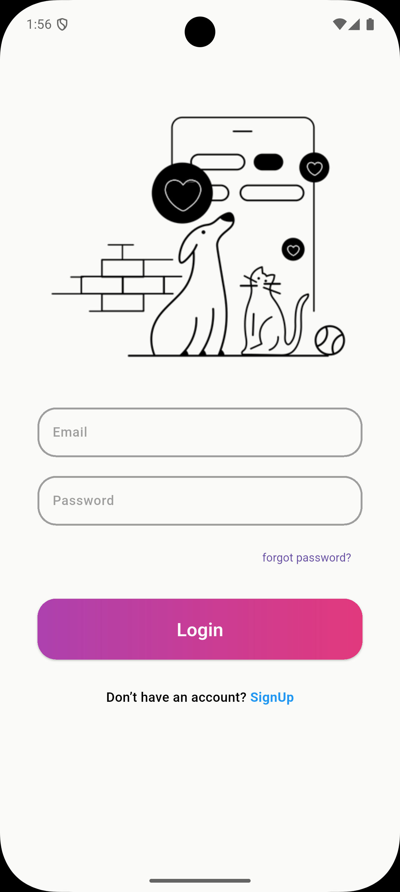
  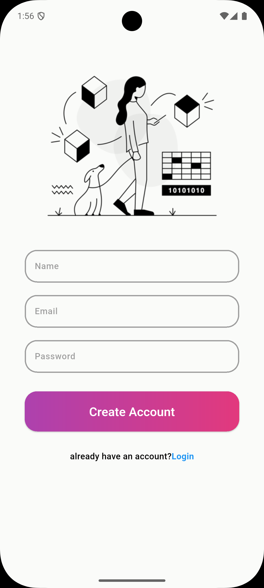
</p>

---

## 🧠 Architecture

```bash
Feature-Based MVVM + Riverpod
```

### 📦 Structure Overview

```
lib/
├── features/
│   ├── authentication/
│   ├── chat/
│   ├── friends_match/
│   ├── home/
│   ├── match/
│   ├── post/
│   ├── profile/
│
│   # Each feature contains:
│   ├── data/
│   ├── model/
│   ├── view/
│   └── view_model/
│
├── common/
├── navigation/
├── util/
│   ├── constants/
│   ├── helpers/
│   ├── theme/
│   └── validators/
│
├── main.dart
└── app.dart
```

---

## 🛠️ Tech Stack

| Tech            | Usage            |
| --------------- | ---------------- |
| Flutter         | UI Development   |
| Riverpod        | State Management |
| Firebase Auth   | Authentication   |
| Cloud Firestore | Database         |
| MVVM            | Architecture     |

---

## ⚙️ Getting Started

### 1. Clone the repo

```bash
git clone https://github.com/yourusername/conet_app.git
cd conet_app
```

---

### 2. Install dependencies

```bash
flutter pub get
```

---

### 3. Run the app

```bash
flutter run
```

---

## 🚀 Future Improvements

* 🤖 AI-based matching & recommendations
* 🔔 Push notifications
* 🌐 Web support
* 📊 User analytics

---

## 👨‍💻 Author

**Ebin Antony**
Co-Founder @ ForgeLabs 🚀

---

## ⭐ Show Your Support

If you like this project, give it a ⭐ on GitHub!

---

## 📄 License

MIT License

---

<div align="center">

✨ Built with Flutter & Passion ✨

</div>
